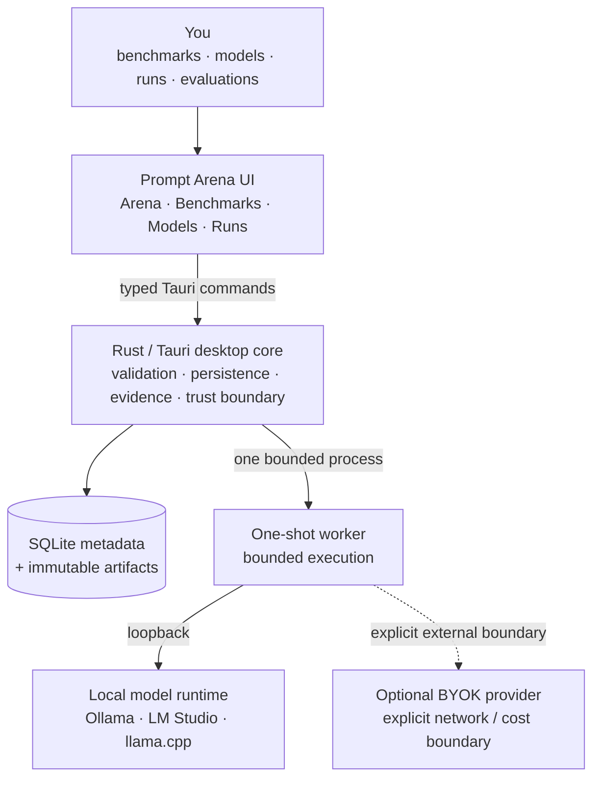
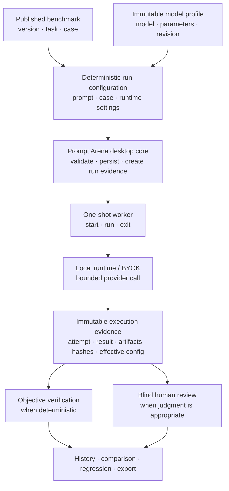

<div align="center">

# Prompt Arena

**Local-first desktop benchmarking for reproducible AI model evaluation.**

[](https://github.com/bielxdh3/Prompt-Arena/releases/latest)
[](https://github.com/bielxdh3/Prompt-Arena/actions/workflows/ci.yml)
[](#project-status)
[](#downloads)
[](#technology)

Prompt Arena runs model benchmarks, preserves immutable execution evidence, compares results, and keeps the primary workflow on your machine.

[**Download v0.1.4 Beta**](https://github.com/bielxdh3/Prompt-Arena/releases/tag/v0.1.4) · [Roadmap](ROADMAP.md) · [Contributing](CONTRIBUTING.md) · [Security](docs/SECURITY.md)

</div>

> [!IMPORTANT]
> Prompt Arena 0.1.4 is a **beta**. Windows has the deepest native QA coverage. Some acceptance work remains around multi-model end-to-end execution, advanced telemetry, llama.cpp live validation, Docker/coding boundaries, and release signing. The current product truth lives in [ROADMAP.md](ROADMAP.md) and [docs/DELIVERY_MATRIX.md](docs/DELIVERY_MATRIX.md).

## Downloads

| Platform | Recommended package | Alternative |
|---|---|---|
| **Windows x64** | [MSI installer](https://github.com/bielxdh3/Prompt-Arena/releases/download/v0.1.4/Prompt-Arena-0.1.4-windows-x64.msi) | [NSIS `.exe`](https://github.com/bielxdh3/Prompt-Arena/releases/download/v0.1.4/prompt-arena-0.1.4-windows-nsis.exe) |
| **Linux x64** | [AppImage](https://github.com/bielxdh3/Prompt-Arena/releases/download/v0.1.4/prompt-arena-0.1.4-linux-appimage.AppImage) | [Debian `.deb`](https://github.com/bielxdh3/Prompt-Arena/releases/download/v0.1.4/prompt-arena-0.1.4-linux-deb.deb) |

Checksums and package-verification evidence are published beside every installer in the [GitHub Release](https://github.com/bielxdh3/Prompt-Arena/releases/tag/v0.1.4).

> [!WARNING]
> Current beta packages are **unsigned** unless a release explicitly says otherwise.

## The idea at a glance



The desktop core owns persistence and trust boundaries. Model output, imported benchmark content, and provider responses are treated as untrusted data.

## How a benchmark round works

A benchmark round starts from versioned inputs and resolves them into a deterministic execution plan before a model is called.



The point is not merely to get an answer from a model. The point is to keep enough evidence to inspect **what ran, with which configuration, against which benchmark version, and how the result was evaluated**.

## What Prompt Arena does

- runs versioned benchmark tasks against immutable model profiles;
- compares 2–8 competitors in Arena workflows;
- runs a single model against benchmark cases or suites;
- preserves runs, attempts, outputs, effective configuration, hashes, and evaluation evidence;
- supports deterministic objective verification and blind human review;
- discovers local models through Ollama, LM Studio, and llama.cpp/GGUF boundaries;
- compares historical runs and calculates deterministic Elo-style ratings;
- runs bounded robustness perturbations;
- exports/imports integrity-checked, secret-sanitized reproduction bundles;
- optionally uses external BYOK provider adapters behind explicit network/cost boundaries;
- packages native desktop builds for Windows and Linux.

## Project status

Current canonical version: **0.1.4 Beta**.

The integrated desktop product is on `main`, the release pipeline is operational, and v0.1.4 packages are published for Windows and Linux. Product gaps are tracked in the roadmap and issue tracker rather than hidden behind a “finished” label.

| Area | Current state |
|---|---|
| Foundation / trust boundary | **Complete** |
| Core multi-model Arena | Implemented; native end-to-end acceptance still open |
| Official packs / verification | Implemented; Docker boundary smoke still open |
| Model Library | Ollama + LM Studio + llama.cpp/GGUF paths implemented; llama.cpp live smoke open |
| Single-model benchmark | Implemented and persisted; live generation-contract acceptance open |
| Performance Lab | Timing/token metrics present; TTFT/system telemetry incomplete |
| Historical comparison | Implemented; statistical depth still limited |
| Elo ratings | Deterministic Elo v1 implemented; richer history/uncertainty remains |
| Robustness Arena | Implemented; semantic-preservation validation remains |
| Repro Bundle | Integrity/export/import implemented; automatic rerun reconstruction remains |
| BYOK | Adapters and safety boundaries implemented; broader real-provider acceptance remains |
| Windows packaging | MSI + NSIS published; signing not yet guaranteed |
| Linux packaging | AppImage + DEB published |

## Technology

| Layer | Technology |
|---|---|
| Desktop shell | Tauri 2 + Rust |
| UI | React 19 + TypeScript |
| Build | Vite 6 |
| Persistence | SQLite + app-owned immutable artifacts |
| Worker | bounded Rust sidecar process |
| Local runtimes | Ollama, LM Studio, llama.cpp/GGUF |
| Validation | Vitest, Cargo tests, repository boundary checks, native package smoke |

## Platform support

| Platform | Status | Packages |
|---|---|---|
| Windows x64 | Primary beta target | MSI, NSIS |
| Linux x64 | Supported beta build target | `.deb`, `.AppImage` |
| macOS | Out of scope | — |

## Run from source

Requirements: Node.js 22+, Rust stable, npm, and a supported local runtime when model execution is desired.

```bash
git clone https://github.com/bielxdh3/Prompt-Arena.git
cd Prompt-Arena
npm ci
npm run tauri:dev
```

Browser preview is available with `npm run dev`, but it is intentionally not equivalent to the desktop app and does not represent native persistence/runtime behavior.

## Validation

Frontend/repository checks:

```bash
npm run check:version
npm run check:boundaries
npm run test:boundaries
npm run typecheck
npm test
npm run build
npm audit --omit=dev --audit-level=high
```

Rust checks:

```bash
cargo fmt --manifest-path src-tauri/Cargo.toml -- --check
cargo check --manifest-path src-tauri/Cargo.toml --all-targets
cargo test --manifest-path src-tauri/Cargo.toml --all-targets
```

CI executes the supported Windows/Linux validation matrix on pushes and pull requests.

## Releases

GitHub Releases are the canonical distribution surface. Release automation builds from an exact ref, re-runs validation, creates Windows/Linux native packages, publishes checksums and verification evidence, and marks 0.x builds as prereleases unless explicitly promoted.

See [docs/RELEASING.md](docs/RELEASING.md), [docs/RELEASE_CHECKLIST.md](docs/RELEASE_CHECKLIST.md), and the [v0.1.4 release notes](docs/releases/v0.1.4.md).

## Local-first and privacy boundary

- no Prompt Arena account or hosted Prompt Arena inference service is required for the local workflow;
- local runtimes use explicit loopback boundaries;
- external APIs are optional BYOK paths and must disclose network egress;
- benchmark versions, profile revisions, evidence, evaluations, and exports are designed to remain auditable;
- browser preview cannot silently substitute for desktop evidence;
- Prompt Arena does not intentionally include product telemetry.

Read [docs/PRIVACY.md](docs/PRIVACY.md) and [docs/SECURITY.md](docs/SECURITY.md).

## Repository map

```text
Prompt-Arena/
├── src/                     React/TypeScript desktop UI
├── src-tauri/               Rust/Tauri core + worker
├── packs/official/          bundled benchmark packs
├── schemas/                 versioned contracts
├── scripts/                 validation and packaging tooling
├── docs/                    architecture, QA, release and policy docs
├── .github/                 CI, release automation, templates, CODEOWNERS
├── CHANGELOG.md             user-visible change history
├── CONTRIBUTING.md          contribution workflow
├── GOVERNANCE.md            project decision model
├── ROADMAP.md               current product truth
└── README.md
```

## Contributing and governance

Contributions are welcome through focused issues and pull requests. Read [CONTRIBUTING.md](CONTRIBUTING.md), [CODE_OF_CONDUCT.md](CODE_OF_CONDUCT.md), and [GOVERNANCE.md](GOVERNANCE.md) first.

Security-sensitive reports should follow [docs/SECURITY.md](docs/SECURITY.md), not a public issue.

## License

The repository is currently **source-available, all rights reserved**. See [LICENSE](LICENSE). No open-source license grant is implied by public source visibility.
